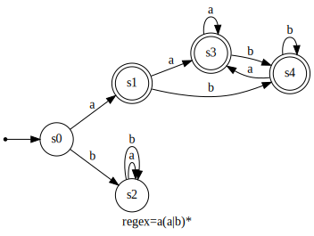
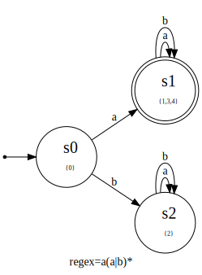

# redfa
Translation regular expression to deterministic finite automata in C

## Usage:
```
./redfa <RegEx> [Options]
```
+ where:
    - Regex = Number or Letter or '|' or '*'

+ Options:
    - -d  Display dfa/nfa strutures
    - -g  Create graph .dot files
    - -s  Show set of corresponding dfa/nfa states

## Example: 

    ./redfa "a(a|b)*" -d -g -s

### -d option display output like this

```
NFA : a(a|b)*
-------------
nStates = 12
Transitions:
	s0  : [ -| 1| /]
	s1  : [ a| 2| /]
	s2  : [ -| 3| /]
	s3  : [ -| 4| =]=>[ -|10| /]
	s4  : [ -| 7| =]=>[ -| 5| /]
	s5  : [ a| 6| /]
	s6  : [ -| 9| /]
	s7  : [ b| 8| /]
	s8  : [ -| 9| /]
	s9  : [ -|10| /]
	s10 : [ -|11| =]=>[ -| 3| /]
	s11 : 

DFA : a(a|b)*
-------------
nSymbols = 2
Symbols  = "ab"
nStates  = 5
States   = [>{0,1},{2,3,4,5,7,10,11}*,{},{3,4,5,6,7,9,10,11}*,{3,4,5,7,8,9,10,11}*]
Transitions:
        a   b
   0:   1   2
   1:   3   4
   2:   2   2
   3:   3   4
   4:   3   4

DFA : a(a|b)*
-------------
nSymbols = 2
Symbols  = "ab"
nStates  = 3
States   = [>{0},{1,3,4}*,{2}]
Transitions:
        a   b
   0:   1   2
   1:   1   1
   2:   2   2
```
### -g option creates .dot files like this



### -g and -s options creates .dot files like this



>> -g option use Graphviz (dot) and eog to visualize images
